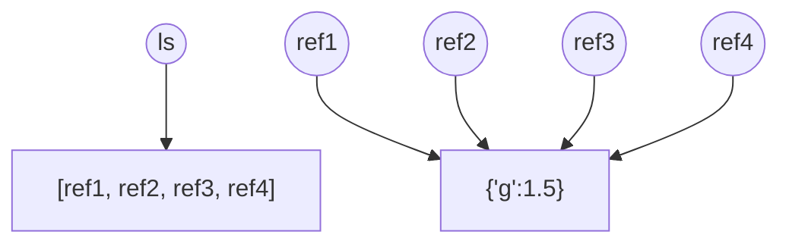
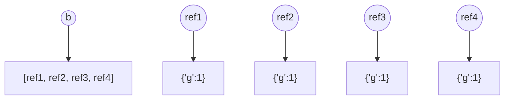
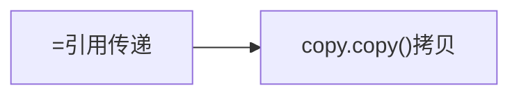
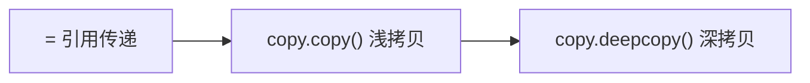

# Something Fun

```python
# 解包时匹配所有其它项

##### 字典默认对key解包
# **dic 可以直接将字典传进函数当作具名参数

##### %开头的命令 是ipython的magic命令
# % linemagic
# %% cell magic
%whos # 查看当前变量空间
%cd 修改目录
%ls 显示目录内容
%load 加载代码
%save 保存cell
%%writefile # 将单元格内容写入到指定文件中，文件格式可为txt、py等
%%reset -f #重制变量空间
%run # 运行脚本
%run -d # 交互式调试器
%timeit 测试代码运行时间
%%timeit 测量代码运行时间


#####Modules 
# 使用import导入
# modules(.py)文件创建之初会有自动加载的内建变量 __name__就是其一

##### Package


```

`==`比较两个对象的值是否相等
`is`比较两个对象的ID是否相同，即是否是同一个对象

> 可以通过`id()`来查看id

> 但整数、短小字符python会为了节省空间缓存这些对象，不会重复的建立和销毁，所以有可能创建的不同引用指向了一个对象
```python
a=2
b=2
print(a is b)
# True
```

## 对象拷贝机制

= 代表传递引用
```python
a=b
#此时a b 指向同一个对象
```
如果需要将b的对象复制一份，然后将新的给a
需要用copy
```python
import copy
a=copy.copy(b)
```

但对于容器类变量：注意其自身存储的是引用

```python
ls = [{'g':1.5}]*4
# 相当于将对{'g':1.5}的引用复制了4次
# 这是因为列表存储的都是引用，这样复制列表，自然复制的是引用
```


```python
b = [{'g':1}]+[{'g':1}]+[{'g':1}]+[{'g':1}]
```



浅拷贝
对于容器，只在引用的层面复制
深拷贝
对于容器，所引用的容器对象内容也被生成副本

对于非容器结构：


对于容器（其中存储引用）：


# String

## Format

```python
string.format(value1, value2, ...)
# The values are either a list of values separated by commas, a key=value list, or a combination of both.
```
**The place holder**
> The placeholders can be identified using named indexes `{price}`, numbered indexes `{0}`, or even empty placeholders `{}`

**Formatting Type**

result:

`:<`  Left aligns the result (within the available space)
```python
txt = "We have {:<8.  } chickens."
print(txt.format(49))
```

`:>`  Right aligns the result (within the available space)

`:^`  Center aligns the result (within the available space)

`:=`  Places the sign to the left most position

`:+`

[Try it](https://www.w3schools.com/python/trypython.asp?filename=demo_string_placeholder5)

Use a plus sign to indicate if the result is positive or negative

`:-`

[Try it](https://www.w3schools.com/python/trypython.asp?filename=demo_string_placeholder6)

Use a minus sign for negative values only

`:` 

[Try it](https://www.w3schools.com/python/trypython.asp?filename=demo_string_placeholder7)

Use a space to insert an extra space before positive numbers (and a minus sign before negative numbers)

`:,`

[Try it](https://www.w3schools.com/python/trypython.asp?filename=demo_string_placeholder8)

Use a comma as a thousand separator

`:_`

[Try it](https://www.w3schools.com/python/trypython.asp?filename=demo_string_placeholder9)

Use a underscore as a thousand separator

`:b`

[Try it](https://www.w3schools.com/python/trypython.asp?filename=demo_string_placeholder10)

Binary format

`:c`

Converts the value into the corresponding unicode character

`:d`

[Try it](https://www.w3schools.com/python/trypython.asp?filename=demo_string_placeholder12)

Decimal format

`:e`

[Try it](https://www.w3schools.com/python/trypython.asp?filename=demo_string_placeholder13)

Scientific format, with a lower case e

`:E`

[Try it](https://www.w3schools.com/python/trypython.asp?filename=demo_string_placeholder14)

Scientific format, with an upper case E

`:f`

[Try it](https://www.w3schools.com/python/trypython.asp?filename=demo_string_placeholder15)

Fix point number format

`:F`

[Try it](https://www.w3schools.com/python/trypython.asp?filename=demo_string_placeholder16)

Fix point number format, in uppercase format (show `inf` and`nan` as `INF` and `NAN`)

`:g`

General format

`:G`

General format (using a upper case E for scientific notations)

`:o`

[Try it](https://www.w3schools.com/python/trypython.asp?filename=demo_string_placeholder19)

Octal format

`:x`

[Try it](https://www.w3schools.com/python/trypython.asp?filename=demo_string_placeholder20)

Hex format, lower case

`:X`

[Try it](https://www.w3schools.com/python/trypython.asp?filename=demo_string_placeholder21)

Hex format, upper case

`:n`

Number format

`:%`

[Try it](https://www.w3schools.com/python/trypython.asp?filename=demo_string_placeholder23)

Percentage format


# Iterator/Generator

### Iterator

> Iterators are methods that iterate collections like [lists](https://www.programiz.com/python-programming/list), [tuples](https://www.programiz.com/python-programming/tuple), etc. Using an iterator method, we can loop through an object and return its elements.

Technically, a Python **iterator object** must implement two special methods, `__iter__()` and `__next__()`, collectively called the **iterator protocol**.

```python
class Fib:
	def __init__(self, n):
		self.prev = 0
		self.cur = 1
		self.n = n
	def __iter__(self):
		return self
	def __next__(self):
		if self.n > 0:
			self.cur, self.prev = self.cur + self.prev, self.cur
			self.n -= 1
            return self.prev
		else:
			raise StopIteration()

f = Fib(10)
print([i for i in f])
```


We use
- ```next(iterator)``` to get the next item
- ```iter(iterable) -> iterator```to get a iterator

### Generators
> In Python, a generator is a [function](https://www.programiz.com/python-programming/function) that returns an [iterator](https://www.programiz.com/python-programming/iterator) that produces a sequence of values when iterated over.

generator本质上就是一个迭代器

Create a Generator
```python
def fib(max = 5):
	while():
		yield 
		. . .
```

**Python Generator Expression**

> a one-line generator

use like this:
```python
 (expression for item in iterable)
```


generator 使用方法

- 可以直接被next（）调用
- 是可迭代对象，可以直接for i in generator: 
- 对于函数形式的generator，将函数实例化` a = gen()` 其中`a`就是一个返回的iterator。 每实例化一次， 就会有一个独立的generator


# Namespace and Scope


https://realpython.com/python-namespaces-scope/

## Namespace

> A namespace is a collection of currently defined symbolic names along with information about the object that each name references. You can think of a namespace as a [dictionary](https://realpython.com/python-dicts) in which the keys are the object names and the values are the objects themselves. Each key-value pair maps a name to its corresponding object.

python有四种namespace：
1.  Built-In
2.  Global
3.  Enclosing
4.  Local

### built-in namespace

```python
dir(__builtins__)
```


### global namespace

The **global namespace** contains any names defined at the level of the main program. Python creates the global namespace when the main program body starts, and it remains in existence until the interpreter terminates.

### Local and enclosing namespace


## Variable Scope

namespace使得相同名字的对象可以在python的不同namespace中同时存在

> The [scope](https://realpython.com/python-scope-legb-rule/) of a name is the region of a program in which that name has meaning. The interpreter determines this at runtime based on where the name definition occurs and where in the code the name is referenced.

也就是说，namespace是关于如何定义变量的概念，sope是针对于如何引用变量的概念

if your code refers to the name `x`, then Python searches for `x` in the following namespaces in the order shown:

1.  **Local**: If you refer to `x` inside a function, then the interpreter first searches for it in the innermost scope that’s local to that function.
2.  **Enclosing**: If `x` isn’t in the local scope but appears in a function that resides inside another function, then the interpreter searches in the enclosing function’s scope.
3.  **Global**: If neither of the above searches is fruitful, then the interpreter looks in the global scope next.
4.  **Built-in**: If it can’t find `x` anywhere else, then the interpreter tries the built-in scope


这也解释了为什么python只能向外访问变量而不能向内访问

## python namespace dictionary

In fact, for global and local namespaces, that’s precisely what they are! Python really does implement these namespaces as dictionaries.

Python provides built-in functions called `globals()` and `locals()` that allow you to access global and local namespace dictionaries.

### globals()
```python
>>> type(globals())
<class 'dict'>

>>> globals()
{'__name__': '__main__', '__doc__': None, '__package__': None,
'__loader__': <class '_frozen_importlib.BuiltinImporter'>, '__spec__': None,
'__annotations__': {}, '__builtins__': <module 'builtins' (built-in)>}
>>> x = 'foo'
>>> globals()['x']
>>> x
>>> globals()['y'] = 100
>>> y
```

### locals()
```python
>>> def f(x, y):
...     s = 'foo'
...     print(locals())
...

>>> f(10, 0.5)
{'s': 'foo', 'y': 0.5, 'x': 10}
```
If you call `locals()` outside a function in the main program, then it behaves the same as `globals()`.

注意：
`globals()` returns an actual reference to the dictionary that contains the global namespace.
`locals()`, on the other hand, returns a dictionary that is a current copy of the local namespace, not a reference to it.

## Modify Variables out of Scope

对于scope外的不可变类型变量--不可修改
对于scope外的可变类型变量--可以原地修改内容（in place）

这和对函数内对函数参数的修改权限是一致的

### global statement

The `global x` statement indicates that while `f()` executes, references to the name `x` will refer to the `x` that is in the global namespace.

If the name specified in the `global` declaration doesn’t exist in the global scope when the function starts, then a combination of the `global` statement and an assignment will create it

本质上global关键字就是通过`global()['']`实现的

### nonlocal statement

Names specified after the `nonlocal` keyword refer to variables in the nearest enclosing scope

总的来说，这两个关键字不仅让变量引用自更高层对象，还赋予了修改更高层对象的权利


# Expression

## Conditional Expression

```python
X if condition else Y
```
if the condition value is true, x is evaluated and its value is returned,
else, Y is evaluated and its value is returned.


## List Expression

```python
matrix=[
	[1,2,3],
	[4,5,6],
	[7,8,9]
]
f_m = [val 
		 # 先大后小
	for ls in matrix 
		for item in ls if item < 6]
```


# Functions

### Functional Programming


## some useful functions

### map/filter
```python
##### map(func, iterable) -> iterator
# 将func作用于iterable中的每一个元素，最终返回一个迭代器

##### filter(func, iterable) -> iterator
# func 的输入应该是iterable中的一个元素，返回应是bool值True or False
# 根据条件过滤iterable中的元素
```

### Lambda function
```python
lambda _arguments_ : _expression_

# use lambda and filter to implement qsort
def qsort(ls):
	if len(ls) <= 1:
		return ls
	return qsort(list(filter(lambda a: a <= ls[0], ls[1:])))
	+[a[0]]# 列表的相加就是直接相连
	+qsort(list(filter(lambda a: a > ls[0], ls[1:])))
```

### sorted
```python
# sorted 函数不改变自身
# 一些容器具有自己的sort函数 这些是改变自身的

# sorted 可以自己设置key来比较大小
sorted(iterable, key = None, reverse = False)
# key是一个函数
# 输入是iterable中的一个元素，输出是一个可以供排序的值
```

### zip/join/spilt
```python
##### zip（iterable，iterable）-> iterator
# 用可迭代对象为参数 对位打包成元组 自动忽略多余项
##### ‘ ’.join(iterable) -> string
# 将可迭代对象以特定元素为间隔连起来形成string

# 比较两个字符串对位是否相同
print(‘’.join([[0, 1][i==j] for i, j in zip(input(),input())]))
```


## Arguments

### Arguments type


### multi-arguments
```python
def fun(a,b,*args, **kargs)
```


## inner function

### Python closures

>Python closure is a nested function that allows us to access variables of the outer function even after the outer function is closed.

Store **a function together with an environment**:
- free variable: variables that are used locally but defined in an enclosing scope

当调用的函数返回的是一个inner function时，这是以closure的形式返回的

Why we use closure:
> Closures can be used to avoid global values and provide data hiding, and can be an elegant solution for simple cases with one or few methods. 
> However, for larger cases with multiple attributes and methods, a class implementation may be more appropriate.

```python
def make_multiplier_of(n):
    def multiplier(x):
        return x * n
    return multiplier


# Multiplier of 3
times3 = make_multiplier_of(3)

# Multiplier of 5
times5 = make_multiplier_of(5)

# Output: 27
print(times3(9))

# Output: 15
print(times5(3))

# Output: 30
print(times5(times3(2)))
```

### Python Decorator

```python
##### 关于变量的引用
# 同一个作用域下，只能有一个同名变量
# python引用变量顺序:当前作用域局部变量->外层作用域变量（nonlocal）->全局变量（global)
# 用nonlocal global 声明改变了优先级
# 但要注意 如果是nonlocal声明，必须保证enclosing-scope确实定义了这个变量 但是在global声明中，就不用保证在global环境中预先定义这个变量

##### 函数是可以生成的 
# 如果返回的是函数，每次返回的都是这个函数的一个实例
# 不同函数实例具有一个私有的运行环境，并不共享———函数闭包

##### 函数闭包
# .__closure__环境参数
# A Closure is a function object that remembers values in enclosing scopes even if they are not present in memory.

##### 

def print_msg(msg):
	def printer():
		print(‘hi’+msg)
	return printer
# 生成一个函数的实例 f1 并不被执行
f1=print_msg(‘fd’) 

##### 函数装饰器
# 对一个函数进行外层包装
# 可以通过函数闭包对装饰器进行定制
# 装饰器实现记忆化存储

def decorator(func):
	def dec():
		. . . 
		func()
		. . .
	# 实例化了一个dechouse
	return dec

# @ 方法也可以构建函数装饰器， 但这样产生的实例只有一个，并没有各自的副本
```


# Class

```python
class Cat():
	# 在一个对象被创建时，先调用new（） new（）开辟一个空间
	# 这个空间的头指针被赋给所有实例方法的第一个变量，也就是self
	# new（） 会调用__init__()
	# 所以每个实例的空间是独立的
	def __init__(self, name):
		self.name = name


	### 类也是对象 所以可以有自己的属性和方法
	# 这些有这个类和其派生的所有实例共享
	catfood = 20

	# 类方法用 @classmethod 装饰器注明
	# 这样在这个类本身被实例化的时候，会将类指针赋给cls
	# cls可以访问自身类属性
	
	# 类属性、类方法一律用类名调用
	
	# 类属性也可以用 <class name>.<name> 的方式调用 但不建议

	# 用self也可以调用类变量 但如果试图改动
	# 就会自动生成一个同名的实例变量（之后二者就分离了

	@classmethod
	def eat(cls):
		 print(cls.catfood)


```
## 变量的访问权限

单下划线开头的变量是（约定俗成的）保护变量
- 可以继承
- import不会被包含
- 可以随便访问

双下划线开头的是（fake）私有变量
- 不能继承
- 类外不能访问
- 但这个特性是通过name mangling完成的，找对名字还是可以访问


## 内置方法


## callable object

`callable()` 判断一个对象是否可以被调用执行
只需在类中定义函数`__call__`

## 类的继承

```python
class A(object):
	pass
class B(A):
	def __init__(self):
		super().__init__()
		# 多继承也可以直接这样初始化父类
		# 按广度优先顺序初始化
	

```

调用重载过的父类中的函数使用`super.`方法


## 内置函数

### `__getattribute__(self, *arg, **kwarg)`

属性拦截器，返回`super().__getattribute__(self,*arg,**kwarg)`

用实例寻找属性时才会被调用，用类调用时不由这个接收

`hasattr()`与 这个不能递归调用，否则会无穷递归

### `__setattri__(self,attr,val)`

被init调用，用来将对象属性添加进对象


# 文件

```python
with open('hello.txt','r','encoding') as f:
	f.read()
	
	for line in my_file:
        print(line)

# This is because the `with` statement calls 2 built-in methods behind the scene – `__enter()__` and `__exit()__`.
# The `__exit()__` method closes the file when the operation you specify is done.
```


# 异常处理


```python
# 异常的捕获
try:
	. . .
except ValueError:
	pass
except:
	pass
finally:
	# 必定执行
```


# type and object--- 面向对象理解


**`object`是所有类的基类**
**type是object的类型，同时，object又是type的基类**

所有 type object（class） 的类型都是type或者继承自type的类（metaclass）


> python 中，一切都是对象
> int、整数2、方法etc. 都是对象

> 面向对象体系中，存在两种关系：
>  	1. 继承关系： 某个对象（类）是另一个对象（类）的特别版本
> 	1. **类型实例关系** ： 一个对象（实例）是另一个对象（类型）的具体实现
> 	
> 	在这两种关系中，具有两种规则
> 	1. **Dashed Arrow Up Rule**：先虚线再实线----虚线
> 	2. **Dashed Arrow Down Rule**：先实线再虚线----虚线
> 	
> 	这两条规则将继承与实例（实线与虚线)联系了起来

## Object（对象） 中有什么

**对象**拥有下面的特征：
1.  对象标识（Identity）
2.  值（A value）：这意味着对象包含一堆属性。我们可以通过`objectname.attributename`的方式操作属性;
3.  类型（A type）:每个对象都有一个确切地类型。
4.  一个或多个“Bases”（One or more bases）：不是所有对象都有Bases，但一些特殊的对象会有，比如：**类**。Bases类似于面向对象语言中的“基类”，“超类”。
	```python
	# 查看其类型 这种写法也印证了类型（type）和类（class）概念相同
	type（object）or object.__class__
	# 查看其基类 这是针对类型对象
	object.__bases__()
## python 对象系统

### bring in the object

object
1. 类型是type --> 从实例化的角度讲
2. 没有基类 --> 从类型继承的角度讲

type
1. 类型是type
2. 基类是object


### 揭晓答案

> python中只有两种对象 可以分成三类
- no-type objects
- type objects
	- metaclass
	- class

$$对象是类\iff class\ 'type’$$
**There are only two kinds of objects in Python: to be unambiguous let's call these types and non-types. Non-types could be called instances, but that term could also refer to a type, since a type is always an instance of another type. Types could also be called classes, and I do call them classes from time to time.**


因此顺理成章：
- 自己创造类型----声明类----继承
- 所有类的类型都是type（除非metaclass）（这是从类--实例的角度来讲）
- 所有类的基类都是object（这是从基类--继承的角度来讲）

### 总结：

1.  在python中有两种对象：
    
    -   类型对象：可以被实例化和继承；
    -   非类型对象：不可以被实例和继承。
2.  <class 'type'>和<class 'object'>是python中的两个源对象。
    
3.  每个**对象**都有类型。用objectname.__class__查看。
    
4.  每个**类型对象**都有超类（object除外），用objectname.__bases__可以查看。
    
5.  通过继承产生的新对象都是**类型对象**。继承是用class语句来实现的。
    
6.  通过实例化产生的新对象可能是**类型对象**，也可能是**非类型对象**。上图中，虚线就表示实例化，第一列和第二列实例化产生的新对象就是**类型对象**。第三列实例化产生的新对象就是**非类型对象**。实例化是通过调用操作符`()`来实现的。比如你自定义了一个类`myclass`,实例化就是在`myclass`后增加`()`操作符完成的。也就是`instance_of_myclass=myclass()`。也就是说，在不考虑metaclass的情况下，只有type实例出的才是类型对象，其余都是非类型对象
7.  一些python的非类型对象可以通过特殊的语法来创造。例如[1, 2, 3]是list的实例。
    
8.  在内部，python总是使用类型对象来创造新对象。新创造的对象是该类型对象的**实例**。（在这里，**实例**有两种意思：一通过继承产生的子类，二是通过实例化产生的具体实例。但平时我们说的实例就是只第二种）。python通过class语句中`指定的超类的类型`来决定`新对象的类型`。


# new() and metaclass

## new()

new（）是一个静态函数，是类的构造函数。

```python
# 初始化方法 在调用__init__()之前，我们的实例已经被创建好了，__init__方法只是为这个实例赋值
__init__()

# 构造函数
__new__()
```

python 默认构造函数逻辑：
```python
def __new__(cls, *args, **kwargs):  
    return super().__new__(cls, *args, **kwargs)
```
可以看出其实`__new__()`只是调用了基类的构造函数

### What will happen when creating a new instance

```python
class Foo:
	pass
f=Foo()
```

The expression `Foo()` creates a new instance of class `Foo`. When the interpreter encounters `Foo()`, the following occurs:

-   The `__call__()` method of `Foo`’s parent class is called. Since `Foo` is a standard new-style class, its parent class is the `type` metaclass, so `type`’s `__call__()` method is invoked.
    
-   That `__call__()` method in turn invokes the following:
    
    -   `__new__()`
    -   `__init__()`

If `Foo` does not define `__new__()` and `__init__()`, default methods are inherited from `Foo`’s ancestry. But if `Foo` does define these methods, they override those from the ancestry, which allows for customized behavior when instantiating `Foo`.

### 单例模式

```python
class SingletonObject:  
    def __new__(cls, *args, **kwargs):  
        if not hasattr(SingletonObject, "_instance"):  
            SingletonObject._instance = object.__new__(cls)  
        return SingletonObject._instance  
      
    def __init__(self):  
        pass
```
这样形成的类只产生一个实例

### 控制实例的创建

```python
class NonZero(int):  
    def __new__(cls, value):  
        return super().__new__(cls, value) if value != 0 else None
```

### class factory（one method to do that）
通过一个容易的接口，通过传入的参数不同的方式，返回对应的不同的类

```python
# 这是三个不同的类
class Last_of_us:  
    def play(self):  
        print('the Last Of Us is really funny')         
class Uncharted:  
    def play(self):  
        print('the Uncharted is really funny')    
class PSGame:  
    def play(self):  
        print('PS has many games')


# 工厂模式的类
class GameFactory:
	# 将类作为字典中的元素出存在类中
	# 注意：这些元素是类元素，在这个类没有构造的时候就存在
    games = {'last_of_us': Last_Of_us, 'uncharted': Uncharted}  
    # new是构造函数，应该返回一个构造好的类
    # 正常来说是返回object（） 然后再用__init__()装饰
    # 不过也可以这样直接返回一个现成的类 这样就直接构造完了
    def __new__(cls, name):  
        if name in cls.games:  
            return cls.games[name]()  
        else:  
            return PSGame()  
          
  
uncharted = GameFactory('uncharted')  
last_of_us = GameFactory('last_of_us')
```

## type()动态创建类

Calling `type()` in this manner creates a new instance of the `type` metaclass. In other words, it dynamically creates a new class.
```python
type(name,bases,duct)
```

-   `<name>` specifies the class name. This becomes the `__name__` attribute of the class.
-   `<bases>` specifies a tuple of the base classes from which the class inherits. This becomes the `__bases__` attribute of the class. 同样会自动继承object
-   `<dct>` specifies a [namespace dictionary](https://realpython.com/python-namespaces-scope/#python-namespace-dictionaries) containing definitions for the class body. This becomes the `__dict__` attribute of the class.

```python
# program to create class dynamically

# constructor
def constructor(self, arg):
	self.constructor_arg = arg

# method
def displayMethod(self, arg):
	print(arg)

# class method
@classmethod
def classMethod(cls, arg):
	print(arg)

# creating class dynamically
Geeks = type("Geeks", (object, ), {
	# constructor
	"__init__": constructor,
	
	# data members
	"string_attribute": "Geeks 4 geeks !",
	"int_attribute": 1706256,
	
	# member functions
	"func_arg": displayMethod,
	"class_func": classMethod
})

# creating objects
obj = Geeks("constructor argument")
print(obj.constructor_arg)
print(obj.string_attribute)
print(obj.int_attribute)
obj.func_arg("Geeks for Geeks")
Geeks.class_func("Class Dynamically Created !")

```


## metaclass

https://realpython.com/python-metaclasses/
`type` is a metaclass, of which classes are instances. Just as an ordinary object is an instance of a class, any new-style class in Python, and thus any class in Python 3, is an instance of the `type` metaclass.

```python

# 继承自type---我们创建的一个元类
class AddInfo(type):
	# 这四个参数正是我们调用type创建类是使用到的参数
    def __new__(cls, name, bases, attr):
        attr['info'] = 'add by metaclass'
        return super().__new__(cls, name, bases, attr)

# Test继承自元类metaclass
class Test(metaclass=AddInfo):
    pass
```

默认来说，所有类都是type的实例化，使用type的__new__()，我们不能直接修改type的这个方法

但是，我们可以自己声明一个新的metaclass，继承自type，然后修改(重载)其`__new__()`方法，然后让自己的类是这个metaclass的实例化，从而达到目的

```python
class Meta(type):
	def __new__(cls,name,bases,dct):
		x=super().__new__(cls,name,bases,dct)


##使用metaclass关键字来确定metaclass
class Foo(metaclass=Meta):
		pass
```


# Instance, Class, and Static Methods

```python
class MyClass:
    def method(self):
        return 'instance method called', self

    @classmethod
    def classmethod(cls):
        return 'class method called', cls

    @staticmethod
    def staticmethod():
        return 'static method called'
```

- the first one: **instance method**

> Through the `self` parameter, instance methods can freely access attributes and other methods on the same object. This gives them a lot of power when it comes to modifying an object’s state.

> Not only can they modify object state, instance methods can also access the class itself through the `self.__class__` attribute. This means instance methods can also modify class state.

When the method is called, Python replaces the `self` argument with the instance object, `obj`. We could ignore the syntactic sugar of the dot-call syntax (`obj.method()`) and pass the instance object _manually_ to get the same result
```python
MyClass.method(obj)
obj.method()
```

这揭示了numpy/torch 等调用时的两种方式为什么可以混用


- the second one: **class method**

> Because the class method only has access to this `cls` argument, it can’t modify object instance state. That would require access to `self`. However, class methods can still modify class state that applies across all instances of the class

```python
Myclass.method()
```

- the third one: **static method**

> This type of method takes neither a `self` nor a `cls` parameter (but of course it’s free to accept an arbitrary number of other parameters).


# os

```python
# os.path

# 从第一个以”/”开头的参数开始拼接
# 在该要求确保的情况下，如果出现"./“开头的参数的上一个参数开始拼接
os.path.join()

```

# PIL

```python
# Image

from PIL import Image
img = Image.open('C:/Users/Administrator/Desktop/g2.jpg')
img.format
img.mode
img.resize()
img.convert() # 格式
```

# collections

provides different types of containers

- [Counters](https://www.geeksforgeeks.org/python-collections-module/#counters)
- [OrderedDict](https://www.geeksforgeeks.org/python-collections-module/#ordereddict)
- [DefaultDict](https://www.geeksforgeeks.org/python-collections-module/#defaultdict)
- [ChainMap](https://www.geeksforgeeks.org/python-collections-module/#chainmap)
- [NamedTuple](https://www.geeksforgeeks.org/python-collections-module/#namedtuple)
- [DeQue](https://www.geeksforgeeks.org/python-collections-module/#deque)
- [UserDict](https://www.geeksforgeeks.org/python-collections-module/#userdict)
- [UserList](https://www.geeksforgeeks.org/python-collections-module/#userlist)
- [UserString](https://www.geeksforgeeks.org/python-collections-module/#userstring)

```python
# OrderedDict
# OrderedDict preserves the order in which the keys are inserted.
from collections import OrderedDict

```

# tqdm

```python 
class tqdm(object):
  """
  Decorate an iterable object, returning an iterator which acts exactly
  like the original iterable, but prints a dynamically updating
  progressbar every time a value is requested.
  """

  def __init__(self, 
               # 可迭代对象，用with手动更新时不需要设置
               iterable=None, 
               # string 进度条描述文字
               desc=None, 
               # 总的项目数
               total=None, 
               # 迭代完成后是否保留进度条
               leave=False,
               # 输出位置
               file=sys.stderr,
               # 宽度
               ncols=None, 
               mininterval=0.1,
               maxinterval=10.0, miniters=None, ascii=None,
               disable=False, 
               # 描述处理项目的文字（default it/s)
               unit='it', 
               # 是否自动根据国际单位进行换算
               unit_scale=False,
               dynamic_ncols=False, smoothing=0.3, nested=False,
               bar_format=None, initial=0, gui=False):
```

**Usage:**

```python
##### 手动设置进度
import time
from tqdm import tqdm

with tqdm(total=200) as pbar:
    # 设置进度条的描述
    pbar.set_description('Processing:')
    # total表示总的项目, 循环的次数20*10(每次更新数目) = 200(total)
    for i in range(20):
        # 进行动作, 这里是过0.1s
        time.sleep(0.1)
        # 进行进度更新, 这里设置10个
        pbar.update(10)
Processing:: 100%|██████████| 200/200 [00:02<00:00, 91.94it/s]

##### 自动设置进度
import time
from tqdm import tqdm, trange

#trange(i)是tqdm(range(i))的一种简单写法
for i in trange(100):
    time.sleep(0.05)

for i in tqdm(range(100), desc='Processing'):
    time.sleep(0.05)

dic = ['a', 'b', 'c', 'd', 'e']
pbar = tqdm(dic)
for i in pbar:
    pbar.set_description('Processing '+i)
    time.sleep(0.2)
100%|██████████| 100/100 [00:06<00:00, 16.04it/s]
Processing: 100%|██████████| 100/100 [00:06<00:00, 16.05it/s]
Processing e: 100%|██████████| 5/5 [00:01<00:00,  4.69it/s]
```


# Matplotlib

## pyplot

https://www.matplotlib.org.cn/tutorials/introductory/pyplot.html#formatting-the-style-of-your-plot

- [`Figure`](https://matplotlib.org/stable/api/figure_api.html#matplotlib.figure.Figure)

  (e.g., windows, Jupyter widgets, etc.), each of which can contain one or more Axes

- [`Axes`](https://matplotlib.org/stable/api/_as_gen/matplotlib.axes.Axes.html#matplotlib.axes.Axes),an area where points can be specified in terms of x-y coordinates (or theta-r in a polar plot, x-y-z in a 3D plot, etc.).

The simplest way of creating a Figure with an Axes is using [`pyplot.subplots`](https://matplotlib.org/stable/api/_as_gen/matplotlib.pyplot.subplots.html#matplotlib.pyplot.subplots). We can then use [`Axes.plot`](https://matplotlib.org/stable/api/_as_gen/matplotlib.axes.Axes.plot.html#matplotlib.axes.Axes.plot) to draw some data on the Axes

```python
fig, ax = plt.subplots()  # Create a figure containing a single axes.
ax.plot([1, 2, 3, 4], [1, 4, 2, 3])  # Plot some data on the axes.
```


- **Figure**

```python
fig = plt.figure()  # an empty figure with no Axes
fig, ax = plt.subplots()  # a figure with a single Axes
fig, axs = plt.subplots(2, 2)  # a figure with a 2x2 grid of Axes
# a figure with one axes on the left, and two on the right:
fig, axs = plt.subplot_mosaic([['left', 'right-top'],
                               ['left', 'right_bottom]])
```

- **Axes**

  An Axes is an Artist attached to a Figure that contains a region for plotting data, and usually includes two (or three in the case of 3D) [`Axis`](https://matplotlib.org/stable/api/axis_api.html#matplotlib.axis.Axis) objects (be aware of the difference between **Axes** and **Axis**) that provide ticks and tick labels to provide scales for the data in the Axes. Each [`Axes`](https://matplotlib.org/stable/api/_as_gen/matplotlib.axes.Axes.html#matplotlib.axes.Axes) also has a title (set via [`set_title()`](https://matplotlib.org/stable/api/_as_gen/matplotlib.axes.Axes.set_title.html#matplotlib.axes.Axes.set_title)), an x-label (set via [`set_xlabel()`](https://matplotlib.org/stable/api/_as_gen/matplotlib.axes.Axes.set_xlabel.html#matplotlib.axes.Axes.set_xlabel)), and a y-label set via [`set_ylabel()`](https://matplotlib.org/stable/api/_as_gen/matplotlib.axes.Axes.set_ylabel.html#matplotlib.axes.Axes.set_ylabel)).

- **Axis**

- Artist

  ```python
  fig, ax = plt.subplots(figsize=(5, 2.7))
  x = np.arange(len(data1))
  ax.plot(x, np.cumsum(data1), color='blue', linewidth=3, linestyle='--')
  l, = ax.plot(x, np.cumsum(data2), color='orange', linewidth=2)
  l.set_linestyle(':')
  ```

  Linewidths, linestyles, and markersizes

  color


### Labeling plot

- Axes labels and text

  [`set_xlabel`](https://matplotlib.org/stable/api/_as_gen/matplotlib.axes.Axes.set_xlabel.html#matplotlib.axes.Axes.set_xlabel), [`set_ylabel`](https://matplotlib.org/stable/api/_as_gen/matplotlib.axes.Axes.set_ylabel.html#matplotlib.axes.Axes.set_ylabel), and [`set_title`](https://matplotlib.org/stable/api/_as_gen/matplotlib.axes.Axes.set_title.html#matplotlib.axes.Axes.set_title) are used to add text in the indicated locations (see [Text in Matplotlib Plots](https://matplotlib.org/stable/tutorials/text/text_intro.html) for more discussion). Text can also be directly added to plots using [`text`](https://matplotlib.org/stable/api/_as_gen/matplotlib.axes.Axes.text.html#matplotlib.axes.Axes.text)

  ```python
  mu, sigma = 115, 15
  x = mu + sigma * np.random.randn(10000)
  fig, ax = plt.subplots(figsize=(5, 2.7), layout='constrained')
  # the histogram of the data
  n, bins, patches = ax.hist(x, 50, density=True, facecolor='C0', alpha=0.75)
  
  ax.set_xlabel('Length [cm]')
  ax.set_ylabel('Probability')
  ax.set_title('Aardvark lengths\n (not really)')
  ax.text(75, .025, r'$\mu=115,\ \sigma=15$')
  ax.axis([55, 175, 0, 0.03])
  ax.grid(True)
  ```

- Annotations

  ```python
  fig, ax = plt.subplots(figsize=(5, 2.7))
  
  t = np.arange(0.0, 5.0, 0.01)
  s = np.cos(2 * np.pi * t)
  line, = ax.plot(t, s, lw=2)
  
  ax.annotate('local max', xy=(2, 1), xytext=(3, 1.5),
              arrowprops=dict(facecolor='black', shrink=0.05))
  
  ax.set_ylim(-2, 2)
  ```

- **Axis scalers and ticks**

  scalers

  ```python
  axs[1].set_yscale('log')
  ```

  Each Axis has a tick *locator* and *formatter* that choose where along the Axis objects to put tick marks. A simple interface to this is [`set_xticks`](https://matplotlib.org/stable/api/_as_gen/matplotlib.axes.Axes.set_xticks.html#matplotlib.axes.Axes.set_xticks):

  ```python
  fig, axs = plt.subplots(2, 1, layout='constrained')
  axs[0].plot(xdata, data1)
  axs[0].set_title('Automatic ticks')
  
  axs[1].plot(xdata, data1)
  axs[1].set_xticks(np.arange(0, 100, 30), ['zero', '30', 'sixty', '90'])
  axs[1].set_yticks([-1.5, 0, 1.5])  # note that we don't need to specify labels
  axs[1].set_title('Manual ticks')
  ```

- Additional Axis objects

  Plotting data of different magnitude in one chart may require an additional y-axis. Such an Axis can be created by using [`twinx`](https://matplotlib.org/stable/api/_as_gen/matplotlib.axes.Axes.twinx.html#matplotlib.axes.Axes.twinx) to add a new Axes with an invisible x-axis and a y-axis positioned at the right (analogously for [`twiny`](https://matplotlib.org/stable/api/_as_gen/matplotlib.axes.Axes.twiny.html#matplotlib.axes.Axes.twiny)). See [Plots with different scales](https://matplotlib.org/stable/gallery/subplots_axes_and_figures/two_scales.html) for another example.

  Similarly, you can add a [`secondary_xaxis`](https://matplotlib.org/stable/api/_as_gen/matplotlib.axes.Axes.secondary_xaxis.html#matplotlib.axes.Axes.secondary_xaxis) or [`secondary_yaxis`](https://matplotlib.org/stable/api/_as_gen/matplotlib.axes.Axes.secondary_yaxis.html#matplotlib.axes.Axes.secondary_yaxis) having a different scale than the main Axis to represent the data in different scales or units. See [Secondary Axis](https://matplotlib.org/stable/gallery/subplots_axes_and_figures/secondary_axis.html) for further examples.

  ```python
  fig, (ax1, ax3) = plt.subplots(1, 2, figsize=(7, 2.7), layout='constrained')
  l1, = ax1.plot(t, s)
  ax2 = ax1.twinx()
  l2, = ax2.plot(t, range(len(t)), 'C1')
  ax2.legend([l1, l2], ['Sine (left)', 'Straight (right)'])
  
  ax3.plot(t, s)
  ax3.set_xlabel('Angle [rad]')
  ax4 = ax3.secondary_xaxis('top', functions=(np.rad2deg, np.deg2rad))
  ax4.set_xlabel('Angle [°]')
  ```

- Color mapped data

  ```python
  X, Y = np.meshgrid(np.linspace(-3, 3, 128), np.linspace(-3, 3, 128))
  Z = (1 - X/2 + X**5 + Y**3) * np.exp(-X**2 - Y**2)
  
  fig, axs = plt.subplots(2, 2, layout='constrained')
  pc = axs[0, 0].pcolormesh(X, Y, Z, vmin=-1, vmax=1, cmap='RdBu_r')
  fig.colorbar(pc, ax=axs[0, 0])
  axs[0, 0].set_title('pcolormesh()')
  
  co = axs[0, 1].contourf(X, Y, Z, levels=np.linspace(-1.25, 1.25, 11))
  fig.colorbar(co, ax=axs[0, 1])
  axs[0, 1].set_title('contourf()')
  
  pc = axs[1, 0].imshow(Z**2 * 100, cmap='plasma',
                            norm=mpl.colors.LogNorm(vmin=0.01, vmax=100))
  fig.colorbar(pc, ax=axs[1, 0], extend='both')
  axs[1, 0].set_title('imshow() with LogNorm()')
  
  pc = axs[1, 1].scatter(data1, data2, c=data3, cmap='RdBu_r')
  fig.colorbar(pc, ax=axs[1, 1], extend='both')
  axs[1, 1].set_title('scatter()')
  ```

  - colormaps

    These are all examples of Artists that derive from [`ScalarMappable`](https://matplotlib.org/stable/api/cm_api.html#matplotlib.cm.ScalarMappable) objects. They all can set a linear mapping between *vmin* and *vmax* into the colormap specified by *cmap*. Matplotlib has many colormaps to choose from ([Choosing Colormaps in Matplotlib](https://matplotlib.org/stable/tutorials/colors/colormaps.html)) you can make your own ([Creating Colormaps in Matplotlib](https://matplotlib.org/stable/tutorials/colors/colormap-manipulation.html)) or download as [third-party packages](https://matplotlib.org/mpl-third-party/#colormaps-and-styles).

  - Normalization

  - Colorbars


### Working with multiple figures and axes

MATLAB, and [`pyplot`open in new window](https://matplotlib.orgapi/_as_gen/matplotlib.pyplot.html#module-matplotlib.pyplot), have the concept of the **current figure** and the **current axes**. All plotting commands apply to the current axes. The function [`gca()`open in new window](https://matplotlib.orgapi/_as_gen/matplotlib.pyplot.gca.html#matplotlib.pyplot.gca) returns the current axes (a [`matplotlib.axes.Axes`open in new window](https://matplotlib.org/api/axes_api.html#matplotlib.axes.Axes) instance), and [`gcf()`open in new window](https://matplotlib.orgapi/_as_gen/matplotlib.pyplot.gcf.html#matplotlib.pyplot.gcf) returns the current figure ([`matplotlib.figure.Figure`open in new window](https://matplotlib.orgapi/_as_gen/matplotlib.figure.Figure.html#matplotlib.figure.Figure) instance). 

You can clear the current figure with [`clf()`open in new window](https://matplotlib.orgapi/_as_gen/matplotlib.pyplot.clf.html#matplotlib.pyplot.clf) and the current axes with [`cla()`](https://matplotlib.orgapi/_as_gen/matplotlib.pyplot.cla.html#matplotlib.pyplot.cla)

```python
#####　注意，平時不需要註明plt.figure(figure) plt.subplot(axes) 是因爲會自動創建figure(1) 和 subplot(111)
plt.figure(1,figsize=(5,8))                # the first figure
plt.subplot(211)             # the first subplot in the first figure
plt.plot([1, 2, 3])
plt.subplot(212)             # the second subplot in the first figure
plt.plot([4, 5, 6])


plt.figure(2)                # a second figure
plt.plot([4, 5, 6])          # creates a subplot(111) by default

plt.figure(1)                # figure 1 current; subplot(212) still current
plt.subplot(211)             # make subplot(211) in figure1 current
plt.title('Easy as 1, 2, 3') # subplot 211 title
```


### Funtions

#### plt.xscale() plt.yscale()

`plt.xscale()` 是 Matplotlib 中用于设置 x 轴坐标轴的缩放类型（比例）的函数。它可以将 x 坐标轴上的数据按照一定的比例进行缩放，以适应不同尺度的数据。

`plt.xscale()` 函数的基本语法如下：

```
python复制代码plt.xscale(scale, **kwargs)
```

其中，`scale` 参数表示要使用的缩放类型。常用的缩放类型包括 `'linear'`（默认值）、`'log'` 等。除此之外，还可以自定义缩放类型，例如 `scale='symlog'` 表示对数刻度缩放，但同时支持负数的对称刻度。


# sklearn


# CV2


